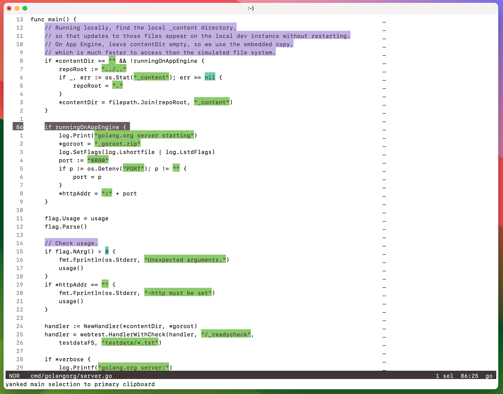
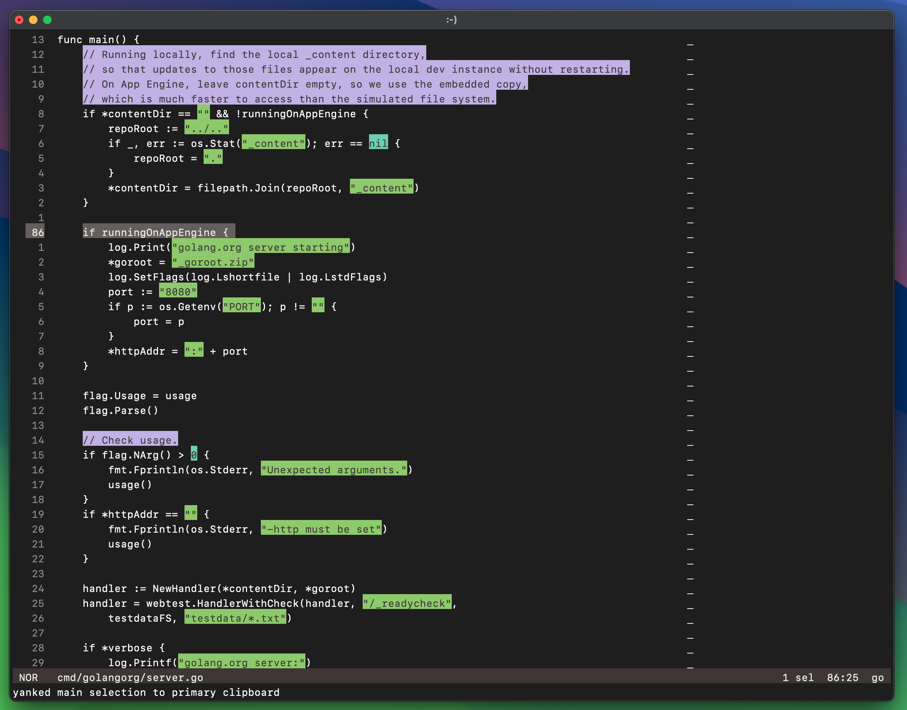

Helix theme, inspired by the [Alabaster color scheme](https://github.com/tonsky/sublime-scheme-alabaster).

This theme uses the terminal base colors only, meaning that you can use this theme in the default Terminal.app on macOS without problems. One benefit of this is that as long as you use a terminal color scheme without explicit foreground and background, you'll get automatic switching between light and dark mode.

The example screenshots below uses a modified Terminal.app color scheme, without an explicit foreground or background set.

