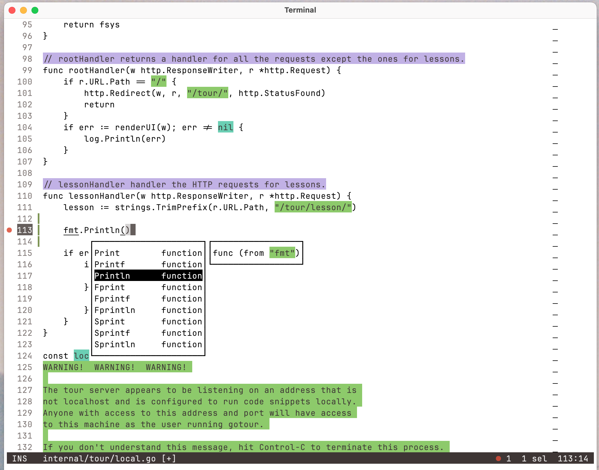
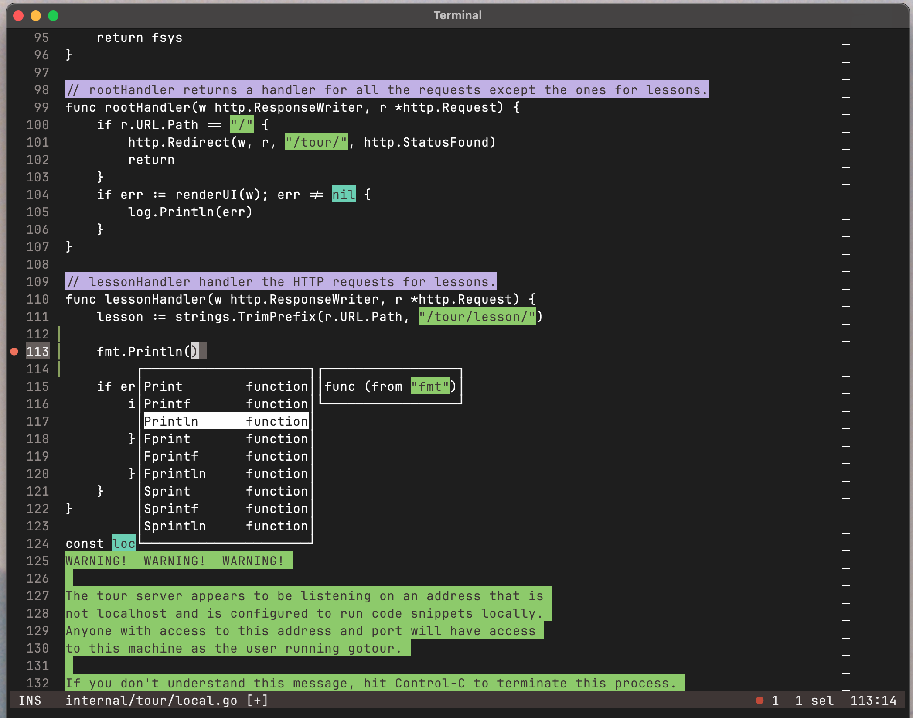

Color scheme and theme, inspired by the [Alabaster color scheme](https://github.com/tonsky/sublime-scheme-alabaster).

The goal is to have a consistent color scheme that plays well with most terminals and apps, as well
as making sure it can handle automatic switching between light and dark modes.

The color scheme is built using [Accessible Palette](https://accessiblepalette.com/).

Here are a couple screenshots of how it might look using Helix in Terminal.app.

